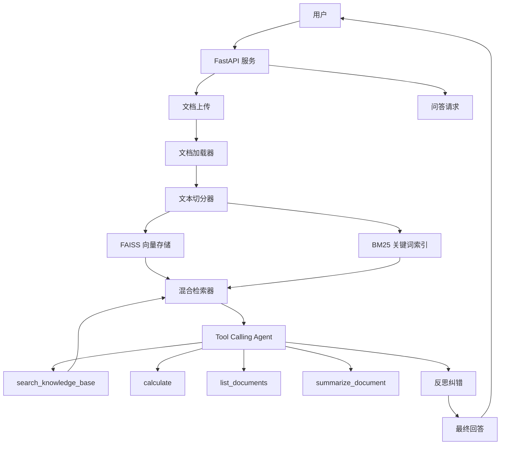

# 智能文档问答系统

基于 RAG + Agent 技术的智能文档问答系统，支持上传 PDF、Markdown、TXT 和 Word 文档，自动构建知识库，并通过自然语言进行问答。

## 系统架构



## 技术栈

| 组件 | 技术 |
|------|------|
| Web 框架 | FastAPI + Uvicorn |
| RAG 框架 | LangChain |
| 向量存储 | FAISS |
| 关键词检索 | rank_bm25 |
| 混合排序 | RRF（Reciprocal Rank Fusion） |
| LLM | OpenAI 兼容接口（ChatOpenAI） |
| Embedding | OpenAI 兼容接口（OpenAIEmbeddings） |
| Agent 模式 | Tool Calling + AgentExecutor |
| 对话记忆 | ConversationBufferWindowMemory |
| 流式输出 | SSE（质量校验后分块返回） |
| 配置管理 | pydantic-settings |

## 快速开始

### 1. 克隆项目

```bash
git clone <repo-url>
cd rag-agent-qa
```

### 2. 安装依赖

```bash
pip install -r requirements.txt
```

### 3. 配置环境变量

```bash
cp .env.example .env
# 编辑 .env 填写 API Key 和模型配置
```

必须配置的项：
- `LLM_API_KEY` - Chat 模型 API Key
- `LLM_API_BASE` - Chat 模型 API 地址
- `LLM_MODEL_NAME` - Chat 模型名称
- `EMBEDDING_API_KEY` - Embedding 模型 API Key
- `EMBEDDING_API_BASE` - Embedding 模型 API 地址
- `EMBEDDING_MODEL_NAME` - Embedding 模型名称

### 4. 启动服务

```bash
uvicorn src.main:app --reload --port 8000
```

### 5. Docker 部署

```bash
docker-compose up -d
```

## API 接口

### 上传文档

```
POST /documents/upload
Content-Type: multipart/form-data

参数: file (PDF/Markdown/TXT/Word 文件)
```

默认单文件上限为 20 MB，可通过 `MAX_UPLOAD_SIZE_MB` 调整。

### 问答

```
POST /qa/ask
Content-Type: application/json

{
  "question": "文档中提到了哪些内容？",
  "session_id": "可选，会话ID"
}
```

### 流式问答

```
POST /qa/ask/stream
Content-Type: application/json

{
  "question": "文档中提到了哪些内容？",
  "session_id": "可选，会话ID"
}

返回 SSE 事件流
```

### 获取对话历史

```
GET /qa/history/{session_id}
```

### 列出文档

```
GET /documents/list
```

### 删除文档

```
DELETE /documents/{doc_name}
```

### 健康检查

```
GET /health
```

## 项目结构

```
rag-agent-qa/
├── src/
│   ├── main.py              # FastAPI 应用入口
│   ├── config.py            # 配置管理
│   ├── api/
│   │   └── routes.py        # API 路由
│   ├── agents/
│   │   ├── qa_agent.py      # Tool Calling Agent + 反思纠错
│   │   └── tools.py         # Agent 工具定义
│   ├── rag/
│   │   ├── loader.py        # 文档加载（PDF/Markdown/TXT/Word）
│   │   ├── splitter.py      # 中文优先文本切分
│   │   ├── embeddings.py    # Embedding 封装
│   │   ├── vectorstore.py   # FAISS 向量存储管理
│   │   └── retriever.py     # 混合检索器（向量+BM25+RRF）
│   ├── memory/
│   │   └── conversation.py  # 会话记忆管理
│   └── utils/
│       └── logger.py        # 日志配置
├── tests/
│   ├── test_rag.py          # RAG 模块测试
│   └── test_agent.py        # Agent 模块测试
├── Dockerfile
├── docker-compose.yml
├── requirements.txt
├── .env.example
└── .gitignore
```

## 技术亮点

- **混合检索**：向量检索（语义相似度）+ BM25（关键词匹配），通过 RRF 算法融合排序，兼顾语义理解和精确匹配
- **Tool Calling Agent**：AgentExecutor 调度知识库检索、计算、文档列表和摘要工具
- **反思纠错**：同步与 SSE 问答统一检查事实性、完整性和一致性，不通过则重试（默认最多 2 次）
- **中文优化**：文本切分使用中文优先分隔符，BM25 使用字符级分词，适配中文场景
- **一致性索引**：上传或覆盖文档时按磁盘文档重建索引，避免同名文档产生重复文本块
- **会话隔离**：基于 session_id 的窗口记忆，网页端自动复用会话并展示检索来源

## 测试

```bash
pytest -q
```

测试覆盖文档加载与切分、混合检索、Agent 反思、来源提取、上传边界和 SSE 会话事件。
